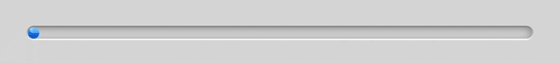

# RetroProgressBar

[](https://cocoapods.org/pods/RetroProgressBar)
[](https://cocoapods.org/pods/RetroProgressBar)
[](https://cocoapods.org/pods/RetroProgressBar)



RetroProgressBar is a customizable progress bar UIView, designed to mimic the classic aesthetics of early iOS and Mac OS X versions. It offers a bubble-like, skeuomorphic appearance, providing a nostalgic feel to your app's user interface.

## Features

*   **Progress Bar Color**: Customize the color of the progress bar.
*   **Corner Radius**: Adjust the corner radius of the progress bar.
*   **Border Width**: Define the width of the progress bar's border.
*   **Border Gradient Colors**: Set multiple colors for the progress bar border, creating a gradient effect.

## Requirements

- iOS 12.0+
- Swift 5.0+

## Instalation

### Cocoapod

RetroProgressBar is available through [CocoaPods](https://cocoapods.org/):

```ruby
pod 'RetroProgressBar'
```

### Swift Package Manager

```
https://github.com/maxkalik/RetroProgressBar.git
```

## Usage

Create an instance of RetroProgressBar. You can add it to your view hierarchy as you would with any UIView.

```swift
let progressBar = RetroProgressBar()
```

### Customization

```swift
progressBar.progressColor = UIColor.systemBlue
progressBar.cornerRadius = 5.0
progressBar.borderWidth = 2.0
progressBar.borderColors = [UIColor.white, UIColor.gray]

```

### Progress Manipulation

Set value without animation

```swift
progressBar.setValue(0.5)
```
This sets the progress bar to 50%.

Set Value with Animation

```swift
progressBar.setValueWithAnimation(0.75, duration: 1.0, animationType: .easeInEaseOut) {
    print("Animation Completed")
}
```
This animates the progress bar to 75% over 1 second with an ease-in-ease-out animation curve.

## Contribution

Contributions are welcome! Please refer to the project's style and contribution guidelines for submitting patches and additions. Issues and pull requests are actively monitored and responded to.